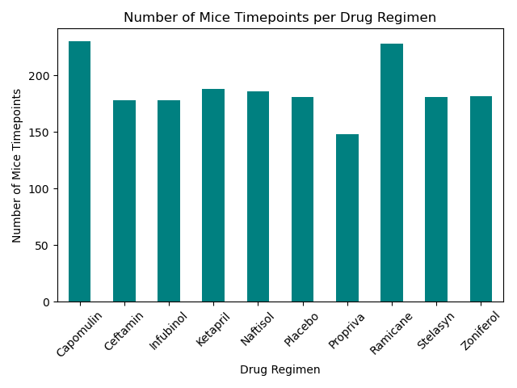
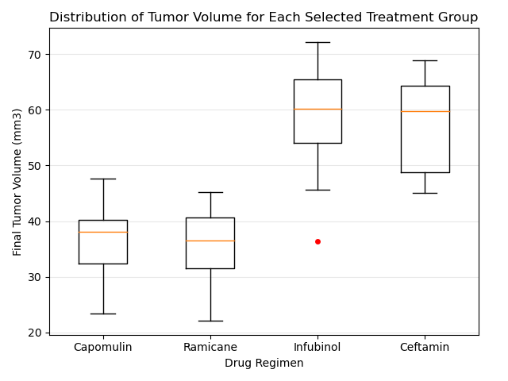
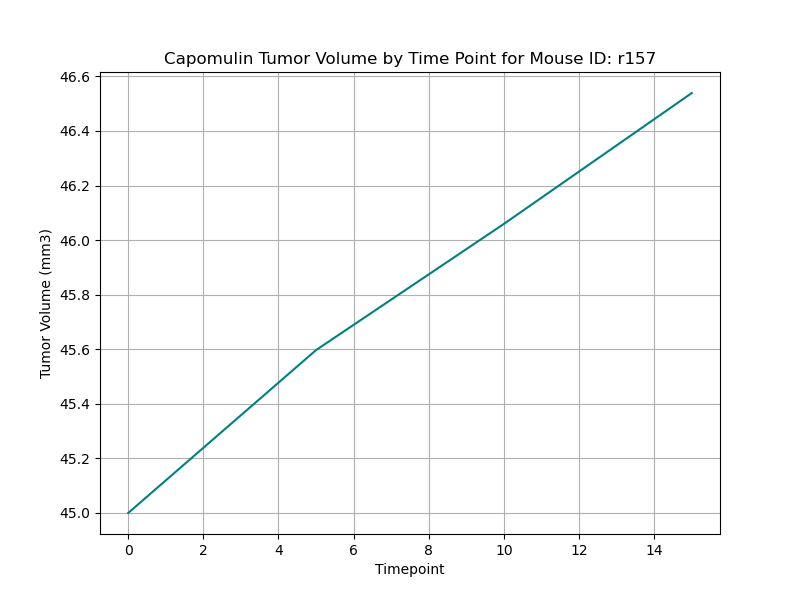
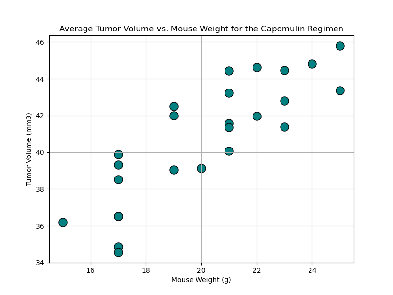
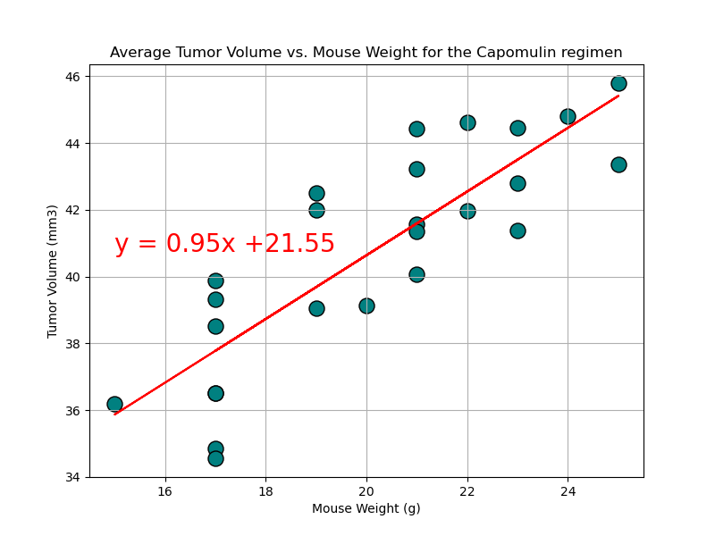

# Pymaceuticals, Inc

)

# A matplotlib challenge

Pymaceuticals, Inc. is pharmaceutical company that specializes in anti-cancer medications. Recently, it began screening for potential treatments for squamous cell carcinoma (SCC), a commonly occurring form of skin cancer.

In this study, 249 mice who were identified with SCC tumors received treatment with a range of drug regimens. Over the course of 45 days, tumor development was observed and measured. The purpose of this study was to compare the performance of Pymaceuticals’ drug of interest, Capomulin, against the other treatment regimens.

The included reporting contains of all the tables and figures needed to report findings of the clinical study. Included is a top-level summary of the study results.

Steps taken to generate the data:

- Prepare the data by importing package dependencies and data imports. Merge the data into one usable DataFrame
- Display the number of unique mouse IDs, then check for any mouse ID with duplicate time points. Display the data associated with the duplicate mouse ID(s). Then create a new DataFrame where this data is removed. Charts are based on unique mouse IDs.

Report and charting information

- Summary statistics generated for each regimine utilized for the following: mean, median, variance, standard deviation, and SEM of the tumor volume.

- Bar and Pie Charts generated for total number of time points for all mice tested for each drug regimen throughout the study. Set of two each, one created with Pandas and one created with Matplotlib.

Bar Chart created with Matplotlib
 >

Bar Chart created with Pandas
 time point for each mouse. Merge this grouped DataFrame with the original cleaned DataFrame.
  - Create a list that holds the treatment names as well as a second, empty list to hold the tumor volume data.
  - Loop through each drug in the treatment list, locating the rows in the merged DataFrame that correspond to each treatment. Append the resulting final tumor volumes for each drug to the empty list.
  - Determine outliers by using the upper and lower bounds, and then print the results.
  - Using Matplotlib, generate a box plot that shows the distribution of the final tumor volume for all the mice in each treatment group. Highlight any potential outliers in the plot by changing their color and style.
    )

Create a Line Plot and a Scatter Plot

- Select a mouse that was treated with Capomulin, and generate a line plot of tumor volume versus time point for that mouse.
  
  
- Generate a scatter plot of tumor volume versus mouse weight for the Capomulin treatment regimen.
  Scatter Chart created with Matplotlib
  
  
  Scatter Chart created with Pandas
  

Calculate Correlation and Regression

- Calculate the correlation coefficient and linear regression model between mouse weight and average tumor volume for the Capomulin treatment.
- Plot the linear regression model on top of the previous scatter plot.
  

Analyze the data and charts and provide an analysis as follows:

Analysis

- Capomulin in mouse r157 shows a change which we might want to examine further. The mice tumor weights show a slight decrease in comparative growth shortly after the study commenced and continued for the remainder of the study.
- Comparing the tumor volume size with the weight of the mouse, the r-value of 0.709 shows a strong linear relationship between the two variables. This could be an indicator that the mice on Capomulin might benefit from weight loss along with the drug regimen.
- Ramicane and Capomulin average tumor volumes were significantly lower by at least 12 cubic millimeters from the other groups although there were a significant higher number of timepoints tested. This may or may not provide an increased statistical sampling of the changes of tumor size over time, leading to less of a probability of another variable causing the change outside of the treatment regimen(s).
- The percentage of female vs male subjects is nearly even. The actual number of mice tested which were male or female changes by nearly 1/2 percent when calculated on the number of timepoints rather than the actual number of mice. However, the results of this study were likely not being affected by the sex of the mice receiving the treatments since the the percentages are nearly 50% female to 50% male.
- Infubinol and Ceftamin did have higher tumor volumes which could suggest these drug regimens may not have been as successful. It is not proper to say they had no effect as the statistical measurements were all lower than the placebo group. It would be proper to say that the effect was not significant enough to warrant further exploration of these 2 drug regimens except possibly in combination with another drug, or some other variable change.
- Conclusions for this study could be better supported by more detailed comparison of the test results against the placebo population.
- The final conclusion for this test study, I recommend Capomulin and Ramicane be moved into the next phase of testing. In this phase, place more emphasis exploring the correlation of the weights of the mice studied along with the administration of the drug.
